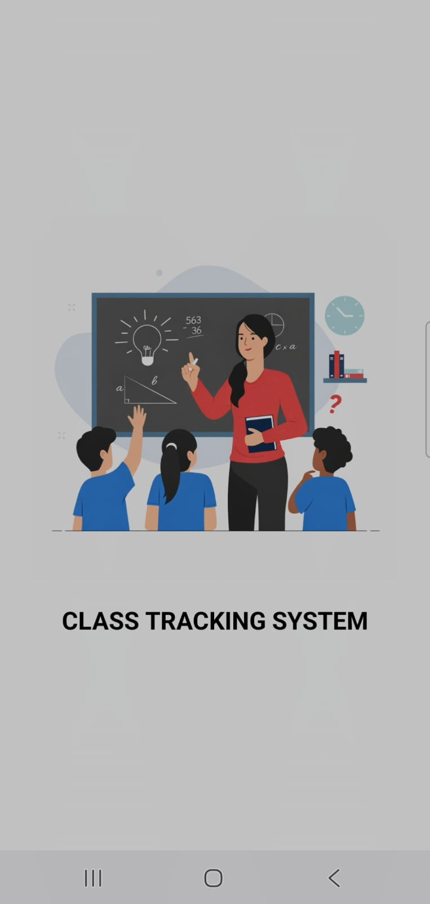
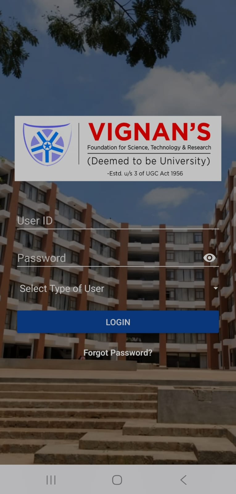
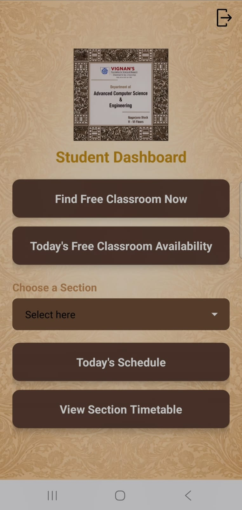
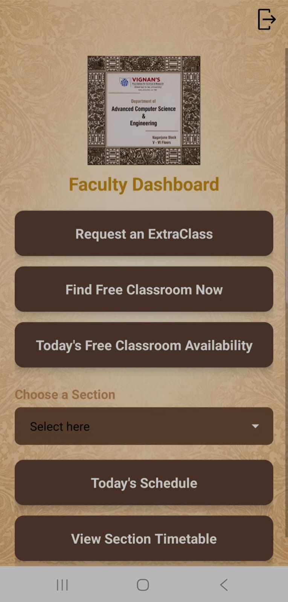
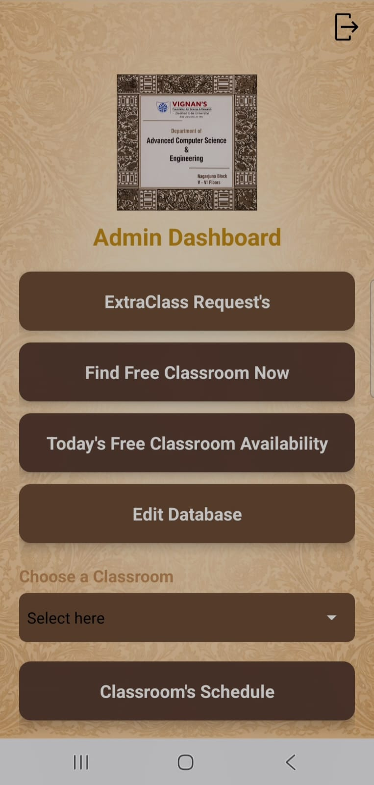

# ClassTrackingSystem

## 🚀 Overview
The Class Tracking System is an Android application designed to automate and simplify classroom scheduling, extra class management, and real-time classroom availability tracking in a university environment.

It reduces dependency on manual timetable checking by providing a centralized system for students, faculty, and administrators.

## 🎯 Problem Statement
In our university, scheduling extra classes and identifying available classrooms is done manually by timetable staff. This process is time-consuming, inefficient, and error-prone. Students also lack real-time visibility of free classrooms, leading to underutilization of campus resources. Additionally, last-minute timetable changes often cause confusion and scheduling conflicts.

This system solves these issues by providing a centralized, role-based platform for managing timetables and classroom availability efficiently.

## ✨ Features

### 🔐 Authentication
- Splash screen (1000 ms delay)
- Login system
- Forgot Password functionality
- Secure logout and exit confirmation dialog to prevent accidental session termination

### 👨‍🎓 Student Dashboard
- Find free classrooms (real-time)
- View today's free classroom availability
- View section’s today schedule
- View full section timetable

### 👨‍🏫 Faculty Dashboard
- Request extra classes
- Find free classrooms (real-time)
- View today's free classroom availability
- View selected section’s schedule
- View section timetable

### 🛠️ Admin Dashboard
- Manage extra class requests
- Find free classrooms (real-time)
- Edit database
- View selected classroom schedule
- View selected section schedule
- View full section timetable

## 🏗️ Tech Stack
- Java , Kotlin (Android Development)
- Android Studio
- XML (UI Design)
- Firebase (Database)

## 🧠 System Workflow
1. User opens app → Splash Screen (1 second)
2. Login / Forgot Password
3. Redirect based on role:
   - Student Dashboard
   - Faculty Dashboard
   - Admin Dashboard
4. Each role accesses specific features and timetable data

## 📸 App UI Screens

### Splash Screen

---

### Login Screen

---

### Student Dashboard

---

### Faculty Dashboard

  
  

---

### Admin Dashboard

## 📈 Advantages
- Better utilization of campus resources
- Reduces manual workload of timetable staff
- Real-time classroom availability
- Role-based access control
- Reduces scheduling conflicts

## 🔮 Future Scope
- Add real-time notifications for timetable changes
- Implementation of an automated timetable generation system that can create optimized schedules without requiring manual entry of data into the database
- Mobile and Web version integration
- Cloud-based synchronization for multi-department access

## 👨‍💻 Author
**P. Rithika Reddy**  
B.Tech ACSE (AI & ML)  
Vignan University
